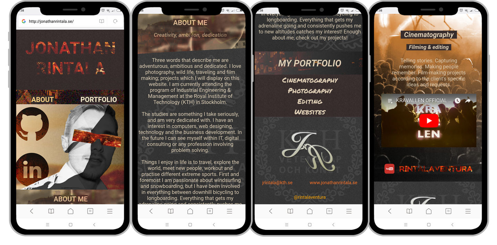
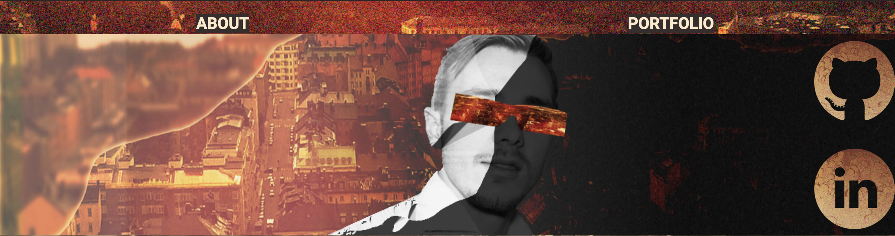
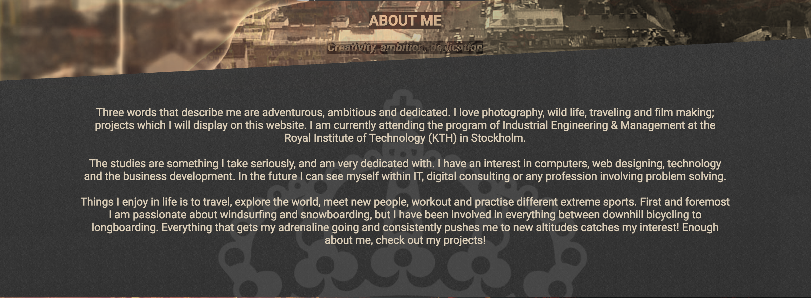
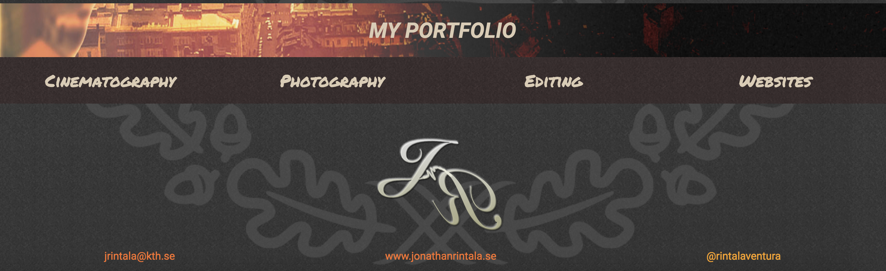

# rintalaventura
My personal webpage and portfolio for digital & creative work. The site is built in ReactJS as a single-page application;
with the primary intent to explore the React framework and allow for future implementation of more complex functionality.
Below are some screens from the project:

## 1. Mobile

## 2. Desktop

  
  
  
  

